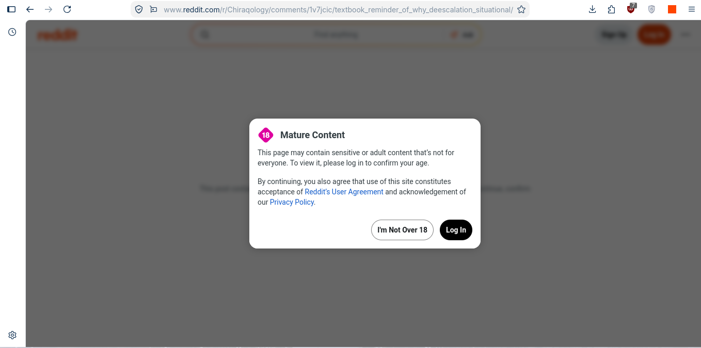
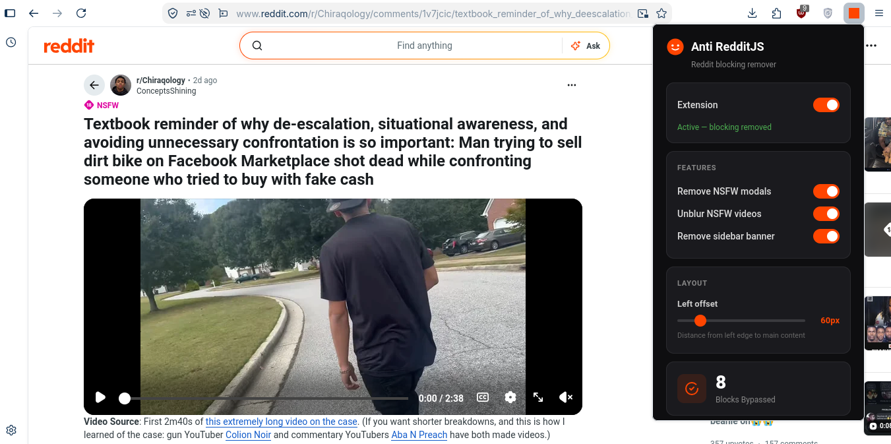

# Anti RedditJS

A browser extension that gets rid of Reddit's annoying NSFW blocking modal, video blur overlays, and sidebar spam — so you can actually read posts without logging in or jumping through hoops.

## Showcase

| Without Extension | With Extension |
|:---:|:---:|
|  |  |

## What it does

- **Removes the NSFW age verification modal** — that "I am over 18" popup that blocks you from reading posts? Gone. Instantly.
- **Unblurs NSFW videos** — removes the blur overlay and blocking screen on video posts so you can watch them right away.
- **Hides the sidebar banner** — gets rid of that weird "Werde Teil des authentischsten Orts im Internet" banner on the left.
- **Expands the post content** — uses the space freed up by removing the sidebar so posts are wider and easier to read.
- **Adjustable left offset** — slide the offset in the popup to control how far from the left edge the main post sits.
- **On/Off toggle** — turn the whole thing off with one click if you want Reddit's default behavior back.
- **Per-feature toggles** — enable or disable modals, video unblur, and sidebar removal independently.
- **Block counter** — keeps track of how many NSFW blocks have been bypassed. Reset it anytime.

## How to install (Chrome / Brave / Edge)

1. Download or clone this repo
2. Open `chrome://extensions/` (or `brave://extensions/` / `edge://extensions/`)
3. Turn on **Developer mode** (top right toggle)
4. Click **Load unpacked**
5. Pick the folder you downloaded
6. Go to any NSFW Reddit post — the blocking stuff is gone

## How to install (Firefox / LibreWolf)

https://addons.mozilla.org/en-US/firefox/addon/anti-redditjs/

1. Download or clone this repo
2. Zip the contents of the folder (the `manifest.json` must be at the root of the zip, not inside a subfolder)
3. Open `about:debugging#/runtime/this-firefox`
4. Click **Load Temporary Add-on**
5. Select the `.zip` file you created
6. Done — visit any NSFW Reddit post

> **Note for Flatpak users:** If you're running Firefox or LibreWolf as a Flatpak, loading `manifest.json` directly won't work due to sandbox restrictions. Use the `.zip` method above instead.

## Using the popup

Click the extension icon in your toolbar to open the popup. From there you can:

- Toggle the extension on/off
- Toggle NSFW modal removal
- Toggle video unblur
- Toggle sidebar removal
- Adjust the left offset with a slider
- See how many blocks have been bypassed
- Reset the counter

All settings are saved automatically and apply immediately — no reload needed.

## Files

- `manifest.json` — Extension manifest (Manifest V3)
- `content.js` — Content script that removes blocking elements and manages features
- `styles.css` — CSS that hides blockers before they even render
- `background.js` — Service worker that manages state and block counter
- `popup.html` / `popup.css` / `popup.js` — Popup UI with toggles, slider, and counter
- `icons/` — Extension icons

## Tested on

- **Google Chrome** — works
- **Brave** — works
- **Mozilla Firefox** — works
- **LibreWolf** — works (load via zip if using Flatpak)

## Notes

- This is for personal use. It bypasses Reddit's age verification, so use it responsibly.
- Reddit may change their DOM structure at any time, which could break the extension. If something stops working, check back for updates.
- Works on Chromium-based browsers (Chrome, Brave, Edge) and Firefox/LibreWolf.
